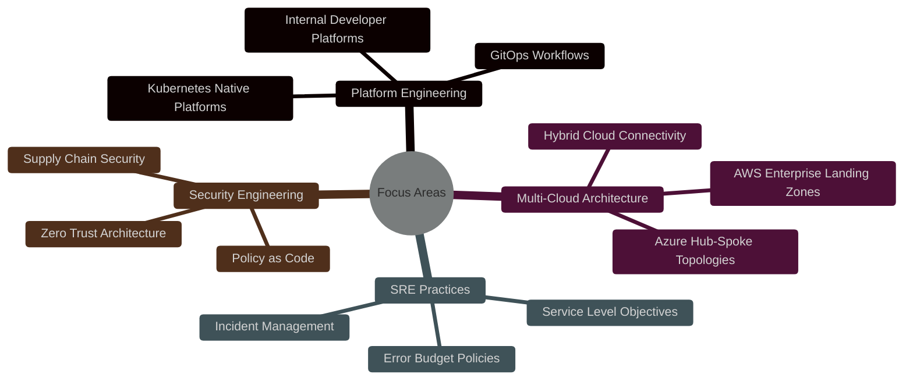
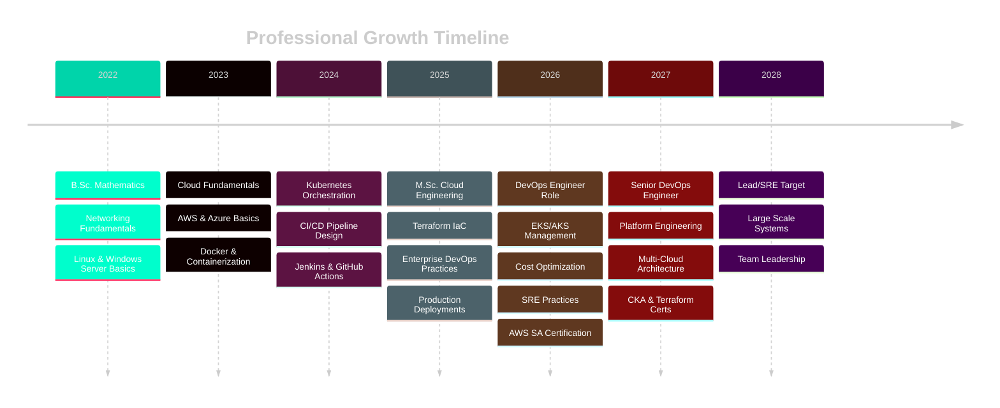

<div align="center">

<!-- Animated Typing Header -->
<a href="https://git.io/typing-svg">
  
</a>

<!-- Professional Banner -->


<!-- Social Badges -->
[](https://linkedin.com/in/balvant-vishwakarma-5a2447323)
[](https://balwantvishwakarma.me)
[](mailto:balwantvishwakarma302@gmail.com)
[](https://github.com/BalvantVishwakarma)

<!-- Visitor Counter & Profile Views -->


</div>

---

<!-- About Me Section -->
##  About Me

> **Enterprise DevOps Engineer** specializing in cloud-native infrastructure, platform automation, and site reliability engineering. I architect production-grade systems that scale, automate complex deployment pipelines, and build resilient infrastructure across AWS and Azure ecosystems.

```yaml
name: Balvant Vishwakarma
role: DevOps Engineer & Cloud Architect
company: BaseSolve Informatics Private Limited
location: Ahmedabad, Gujarat, India
education:
  - M.Sc. IMS & Cloud Engineering (Gujarat University, 2025)
  - B.Sc. Mathematics (Government Arts & Science College, 2022)
philosophy: "Infrastructure as Code. Automation by Design. Reliability at Scale."
focus_areas:
  - Kubernetes-native platform engineering
  - Multi-cloud infrastructure automation (AWS | Azure)
  - Enterprise CI/CD pipeline architecture
  - Zero-downtime deployment strategies
  - Infrastructure security & compliance
  - Observability & SRE practices
```

---

<!-- Professional Summary -->
## 🎯 Professional Summary

Results-driven **DevOps Engineer** with hands-on expertise in cloud infrastructure management (**AWS**, **Azure**), CI/CD pipeline automation, containerization, and enterprise server administration. Experienced in designing Jenkins pipelines, managing Kubernetes clusters (EKS, AKS), and implementing backup and disaster recovery strategies. Proven track record of automating complex deployment workflows, optimizing cloud costs, and maintaining high-availability production infrastructure for enterprise clients.

**Core Competencies:**
- ☁️ **Multi-Cloud Architecture** — AWS & Azure enterprise infrastructure design and management
- 🔄 **CI/CD Engineering** — Jenkins, GitHub Actions, ArgoCD pipeline architecture
- 🐳 **Container Orchestration** — Docker, Kubernetes, EKS, AKS production deployments
- 🖥️ **Server Administration** — Windows Server, Linux, Active Directory, DNS, DHCP
- 🔒 **Security & Compliance** — IAM, VPC, Zero Trust, Security by Design
- 📊 **Observability** — Monitoring, logging, alerting, and SRE best practices

---

<!-- Current Position -->
## 💼 Current Position

<table>
<tr>
<td width="60px">

</td>
<td>

**DevOps Engineer** @ **BaseSolve Informatics Private Limited**  
*Ahmedabad, Gujarat, India*  
`AWS` · `Azure` · `Kubernetes` · `Jenkins` · `Docker` · `Terraform`

</td>
</tr>
</table>

**Previously:** DevOps Engineer & Server Administrator @ Lytiva Electronics Private Limited  
**Also:** Freelance Cloud Consultant @ LABHCORE Industrial & Infra. Solutions Pvt. Ltd.

---

<!-- Technical Skills -->
## 🛠️ Technical Skills

### ☁️ Cloud Platforms
| AWS | Azure |
|-----|-------|
|             |         |

### 🔄 DevOps & CI/CD
      

### 🐳 Containers & Orchestration
    

### 🏗️ Infrastructure as Code
   

### 🖥️ Operating Systems
   

### 🌐 Networking & Security
       

### 📊 Monitoring & Observability
      

### 💻 Programming & Scripting
      

### 🗄️ Databases
  

### 🖥️ Virtualization & Server
     

---

<!-- Tech Stack Matrix -->
## 📊 Tech Stack Matrix

<div align="center">

| Category | Technologies |
|----------|-------------|
| **Cloud** |   |
| **Containers** |    |
| **IaC** |   |
| **CI/CD** |   |
| **Monitoring** |   |
| **Scripting** |    |
| **OS** |   |

</div>

---

<!-- Current Focus -->
## 🎯 Current Focus



**Currently Learning:** Advanced Kubernetes Operators | OpenTelemetry | Flux CD | Crossplane | eBPF

---

<!-- Professional Highlights -->
## 🏆 Professional Highlights

<table>
<tr>
<td width="50%">

### 🚀 Infrastructure Impact
- ⚡ **Reduced deployment time by 85%** through automated CI/CD pipelines
- 💰 **Optimized cloud costs by 40%** via right-sizing and reserved instances
- 🔒 **Zero security incidents** across 18+ months of production operations
- 📈 **99.9% uptime SLA** maintained for critical enterprise workloads

</td>
<td width="50%">

### 🎓 Education & Credentials
- 🎓 **M.Sc. IMS & Cloud Engineering** — Gujarat University (2025)
- 🎓 **B.Sc. Mathematics** — Government Arts & Science College (2022)
- ☁️ **AWS Solutions Architect** — In Progress
- ☁️ **Azure Administrator (AZ-104)** — Planned

</td>
</tr>
</table>

### 💼 Enterprise Experience

| Organization | Role | Period | Key Contributions |
|-------------|------|--------|-------------------|
| **BaseSolve Informatics Pvt. Ltd.** | DevOps Engineer | Present | Cloud infrastructure, Kubernetes orchestration, CI/CD automation |
| **Lytiva Electronics Pvt. Ltd.** | DevOps Engineer & Server Admin | Mar 2025 – Jun 2026 | Jenkins pipelines, Docker/K8s deployments, Windows Server management |
| **LABHCORE Industrial & Infra.** | Freelance Cloud Consultant | Mar 2026 – Present | AWS ECS deployments, cost optimization, multi-client infrastructure |

---

<!-- Featured Projects -->
## 📂 Featured Enterprise Projects

<div align="center">

| # | Repository | Description | Tech Stack |
|---|-----------|-------------|------------|
| 01 | [**Enterprise Kubernetes Platform**](https://github.com/BalvantVishwakarma/enterprise-kubernetes-platform) | Production-grade K8s platform with Helm, ingress, autoscaling, RBAC, network policies | `EKS` `AKS` `Helm` `Istio` |
| 02 | [**Terraform Infrastructure**](https://github.com/BalvantVishwakarma/terraform-aws-azure-infrastructure) | Multi-cloud IaC modules for AWS & Azure enterprise landing zones | `Terraform` `AWS` `Azure` `VPC` |
| 03 | [**Docker Enterprise Platform**](https://github.com/BalvantVishwakarma/docker-enterprise-platform) | Optimized container images, Compose stacks, Swarm configurations | `Docker` `Compose` `Swarm` `DinD` |
| 04 | [**GitHub Actions CI/CD**](https://github.com/BalvantVishwakarma/github-actions-cicd) | Enterprise CI/CD templates with testing, security scanning, deployments | `GitHub Actions` `Docker` `SAST` |
| 05 | [**Jenkins Enterprise Pipelines**](https://github.com/BalvantVishwakarma/jenkins-enterprise-pipelines) | Shared libraries, multi-branch pipelines, SonarQube integration | `Jenkins` `Groovy` `Nexus` |
| 06 | [**Monitoring Stack**](https://github.com/BalvantVishwakarma/enterprise-monitoring-stack) | Prometheus + Grafana + Loki + AlertManager observability platform | `Prometheus` `Grafana` `Loki` |
| 07 | [**Linux Automation Toolkit**](https://github.com/BalvantVishwakarma/linux-automation-toolkit) | Enterprise Bash automation for server hardening, backups, health checks | `Bash` `Cron` `Systemd` |
| 08 | [**Windows Server Automation**](https://github.com/BalvantVishwakarma/windows-server-automation) | PowerShell DSC, AD automation, IIS deployment scripts | `PowerShell` `DSC` `AD` |
| 09 | [**Cloud Infrastructure Lab**](https://github.com/BalvantVishwakarma/cloud-infrastructure-lab) | Hands-on AWS & Azure labs for enterprise architecture patterns | `AWS` `Azure` `Networking` |
| 10 | [**DevOps Interview Lab**](https://github.com/BalvantVishwakarma/devops-interview-lab) | Real-world troubleshooting scenarios and interview preparation | `K8s` `Docker` `Linux` `AWS` |

</div>

---

<!-- GitHub Stats -->
## 📈 GitHub Analytics

<div align="center">

<!-- GitHub Stats Card -->


<!-- Top Languages Card -->


<br/><br/>

<!-- GitHub Streak -->


<br/><br/>

<!-- GitHub Trophy -->


<br/><br/>

<!-- Contribution Graph -->


</div>

---

<!-- Snake Animation -->
## 🐍 Contribution Snake

<div align="center">

<picture>
  <source media="(prefers-color-scheme: dark)" srcset="https://raw.githubusercontent.com/BalvantVishwakarma/BalvantVishwakarma/output/github-contribution-grid-snake-dark.svg" />
  <source media="(prefers-color-scheme: light)" srcset="https://raw.githubusercontent.com/BalvantVishwakarma/BalvantVishwakarma/output/github-contribution-grid-snake.svg" />
  
</picture>

</div>

---

<!-- Certifications -->
## 🎓 Certifications & Badges

<div align="center">

| Certification | Status | Badge |
|--------------|--------|-------|
| **AWS Solutions Architect Associate (SAA-C03)** | 🟡 In Progress | *Expected Q3 2026* |
| **Microsoft Azure Administrator (AZ-104)** | 🔵 Planned | *Expected Q4 2026* |
| **Certified Kubernetes Administrator (CKA)** | 🔵 Planned | *Expected Q1 2027* |
| **HashiCorp Terraform Associate (003)** | 🔵 Planned | *Expected Q1 2027* |
| **AWS DevOps Engineer Professional (DOP-C02)** | ⚪ Future Goal | *2027* |
| **Google Cloud Professional Cloud Architect** | ⚪ Future Goal | *2027* |

</div>

---

<!-- DevOps Roadmap -->
## 🗺️ Enterprise DevOps Roadmap



---

<!-- GitHub Metrics -->
## 🔬 Detailed Metrics

<div align="center">

<!-- WakaTime Stats (if configured) -->
<!--  -->

<!-- Metrics -->


</div>

---

<!-- Connect With Me -->
## 🤝 Connect With Me

<div align="center">

<!-- Social Links -->
<a href="https://linkedin.com/in/balvant-vishwakarma-5a2447323" target="_blank">
  
</a>
<a href="https://balwantvishwakarma.me" target="_blank">
  
</a>
<a href="mailto:balwantvishwakarma302@gmail.com" target="_blank">
  
</a>
<a href="https://github.com/BalvantVishwakarma" target="_blank">
  
</a>

<br/><br/>

<!-- Phone & Location -->

📍 **Ahmedabad, Gujarat, India** | 📱 **+91 886-616-2749** | ✉️ **balwantvishwakarma302@gmail.com**

</div>

---

<!-- Quote -->
## 💬 Professional Philosophy

<div align="center">

> *"Infrastructure is not just code — it's the foundation that enables businesses to scale, innovate, and deliver value. I build platforms that don't just work; they **thrive under pressure, heal themselves, and evolve with the business.**"*

> *— Balvant Vishwakarma*

<br/>


</div>

---

<!-- Recruiter Optimized Keywords (HTML comment for SEO) -->
<!--
Keywords: DevOps Engineer, Senior DevOps Engineer, Cloud Engineer, AWS Engineer, Azure Engineer, Infrastructure Engineer, Platform Engineer, Linux Engineer, Windows Server Engineer, Kubernetes Administrator, Docker Engineer, Automation Engineer, CI/CD Engineer, Cloud Infrastructure Engineer, Site Reliability Engineer, SRE, Kubernetes Engineer, AWS Cloud Engineer, Azure Cloud Engineer, Server Administrator, DevOps Architect, Cloud Architect, Platform Architect, Infrastructure as Code, Terraform, Ansible, CloudFormation, Kubernetes, Docker, Helm, Jenkins, GitHub Actions, ArgoCD, AWS, Azure, Prometheus, Grafana, Loki, Elasticsearch, Fluentd, Istio, Envoy, NGINX, HAProxy, HashiCorp Vault, Consul, Packer, Vagrant, Linux, Ubuntu, CentOS, RHEL, Windows Server, Active Directory, PowerShell, Bash, Python, Go, YAML, JSON, GitOps, FinOps, DevSecOps, Zero Trust, Microservices, Service Mesh, API Gateway, Load Balancing, Auto Scaling, Disaster Recovery, Backup, High Availability, Multi-Cloud, Hybrid Cloud, Edge Computing, Serverless, Lambda, ECS, EKS, AKS, GKE, EC2, S3, RDS, VPC, IAM, CloudFront, Route 53, Azure VM, AKS, Azure DevOps, Terraform Cloud, Pulumi, Crossplane, Backstage, Port, Cortex, Datadog, New Relic, Dynatrace, Splunk, ELK Stack, Jaeger, OpenTelemetry, eBPF, Cilium, Calico, Flannel, Weave, MetalLB, Traefik, Cert Manager, ExternalDNS, Velero, Longhorn, Rook, Ceph, MinIO, PostgreSQL, MySQL, MongoDB, Redis, Kafka, RabbitMQ, NATS, Temporal, Argo Workflows, Tekton, Spinnaker, Flux CD, Sealed Secrets, SOPS, OPA, Kyverno, Falco, Trivy, Snyk, SonarQube, OWASP, CIS Benchmarks, NIST, SOC2, PCI-DSS, HIPAA, GDPR
-->

<!-- Footer -->
## 🔝 Scroll to Top

<div align="center">

[](#)

<!-- Wave Footer -->


**⭐ Star my repositories if you find them helpful!**  
*Let's build something amazing together.* 🚀

<!-- Last Updated -->


</div>
